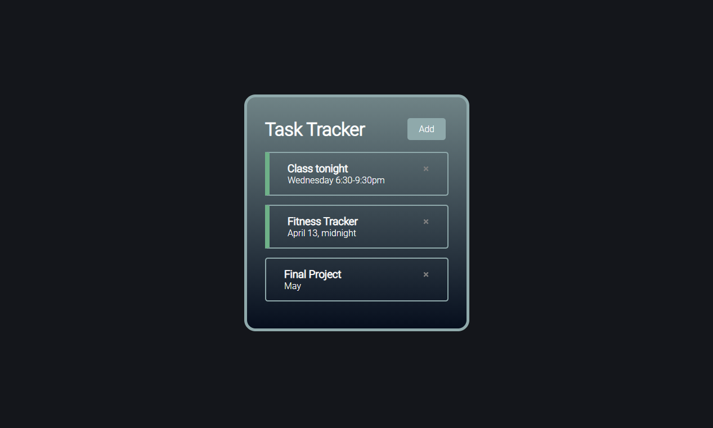
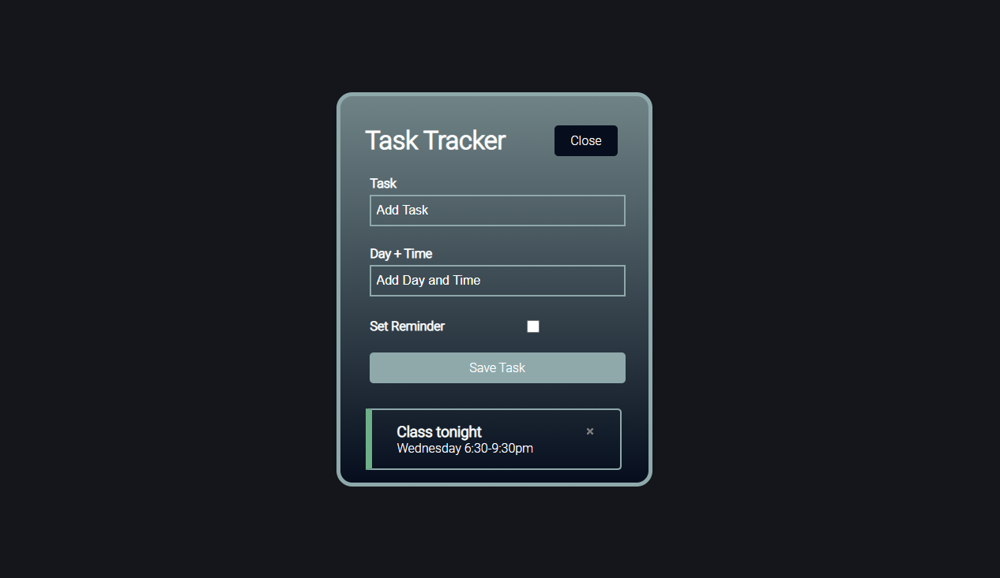

# React Task Tracker

### A take on a task tracking app using components, state, props and hooks in React.js.

## *Table of Contents*

- [Description](#description)
- [Screenshots](#screenshots)
- [Contact](#contact)

## *Description*

Check out the [GitHub repo](https://github.com/bradtraversy/react-crash-2021) and [YouTube walkthrough](https://youtu.be/w7ejDZ8SWv8) from developer Brad Traversy, and view my [deployed demo](path).

## *Screenshots*

## *Contact*

Links in Bio @[katsign](https://github.com/katsign)

---
&copy; 2021
